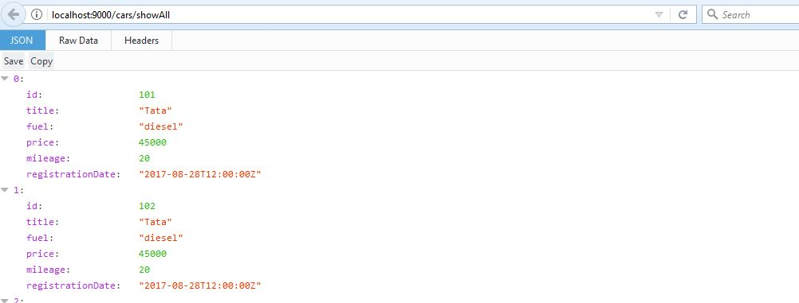
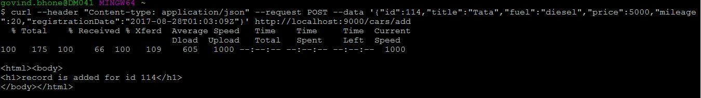

# Car adverts Problem 

Table of contents
=================

  * [Problem Statement ](#problem-statement)
  * [System requierments](#system-requierments)
  * [Steps to build and run](#steps-to-build)
  * [Running service Requests](#running-service-requests)
  * [Expected Output](#expected-output)
  


## Problem Statement 
Create a git repository (either local or public one on GitHub) that contains a RESTful web-service written in Scala. The service should
allow users to place new car adverts and view, modify and delete existing car adverts.
Car adverts should have the following fields:
* **id** (_required_): **int** or **guid**, choose whatever is more
convenient for you;
* **title** (_required_): **string**, e.g. _"Audi A4 Avant"_;
* **fuel** (_required_): gasoline or diesel, use some type which
could be extended in the future by adding additional fuel types;
* **price** (_required_): **integer**;
* **new** (_required_): **boolean**, indicates if car is new or
used;
* **mileage** (_only for used cars_): **integer**;
* **first registration** (_only for used cars_): **date** without
time.

####Service should:
* have functionality to return list of all car adverts;
* optional sorting by any field specified by query parameter,
default sorting - by **id**;
* have functionality to return data for single car advert by id;
* have functionality to add car advert;
* have functionality to modify car advert by id;
* have functionality to delete car advert by id;
* have validation (see required fields and fields only for used
cars);
* accept and return data in JSON format, use standard JSON date
format for the **first registration** field.
#### Additional requirements
* Service should be able to handle CORS requests from any domain.
* Think about test pyramid and write unit-, integration- and
acceptance-tests if needed.
* It's not necessary to document your code, but having a readme.md
for developers who will potentially use your service would be great.
#### Tips, hints & insights
* Feel free to use any Scala or sbt versions.
* Feel free to make any assumptions as long as you can explain them.
* Think how to use HTTP verbs and construct your HTTP paths to
represent different actions (key word - RESTful).
* Commit frequently, small commits will help us to understand how
you tackle the problem.
* We're using Play! at AutoScout24, but feel free to use a different
Scala framework of your choice.
* If you decide to use Play!, try to use version 2.4 and do not
use **GlobalSettings** or any globals like **Play.configuration** or
**Play.application**, use dependency injection instead.
* We're using Amazon Dynamo DB, but feel free to use different
storage as long as we will be able to run it without doing excessive
configuration work.
* If you decide to use local Amazon Dynamo DB, which could be
downloaded from Amazon as a [tar.gz](http://dynamodb-local.s3-
website-us-west-2.amazonaws.com/dynamodb_local_latest.tar.gz) or
[zip](http://dynamodb-local.s3-website-us-west-2.amazonaws.com/
dynamodb_local_latest.zip) archive or installed with **homebrew** if
you're using MacOS: ```brew install dynamodb-local```, try to not
store data in Dynamo DB as a string blob, try to either use a Dynamo
DB document model or store every field as a separate attribute

## System Requirements 
 * Java Runtime Environment above 7 (http://www.oracle.com/technetwork/indexes/downloads/index.html#java)
 * sbt (http://www.scala-sbt.org/0.13/docs/Installing-sbt-on-Linux.html)
 * mysql installation (https://dev.mysql.com/downloads/installer/) and starting mysql

## Steps to Build and Run
 * clone the git repo 
 * go to root folder of the project 
 * Run command `sbt compile`
 * Run command `sbt run`

## Running Service requests
 * go to browser and type `http://localhost:9000/<serviceurl>`
 * curl command `curl --header "Content-type: application/json" --request POST --data '{"id":114,"title":"Tata","isNew":false,"fuel":"diesel","price":5000,"mileage":20,"registrationDate":"2017-08-28T01:03:09Z"}' http://localhost:9000/cars/add`

## Expected Output 


